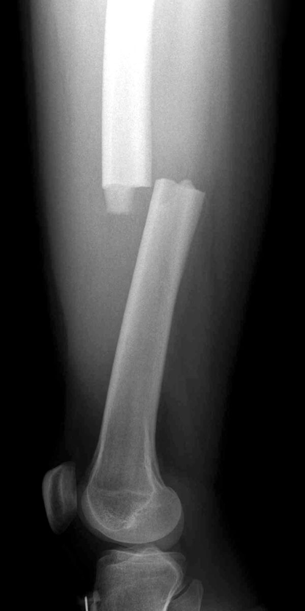

# Image enhancement using openCV

An image enhancement module used for improving the quality of images using different filters in openCV. 
It works better with gray-scale images

## Table of contents

- [Getting started](#getting-started)
- [Features](#features)
- [Usage](#usage)
- [Results](#results)
- [Want to Contribute?](#want-to-contribute)
- [Need Help / Support?](#need-help)
- [Collection of Other Components](#collection-of-components)
- [Changelog](#changelog)
- [Credits](#credits)
- [License](#license)
- [Keywords](#Keywords)

## Getting started

Prerequisites for running the code are:

Python =3.5<br/>
python-opencv =4.2.0<br/>
scipy =1.3.1<br/>

or

```
pip install opencv-python
```
```
pip install scipy
```

## Features

- Denoise a grayscale image with median_filter
- Clahe is used for Histogram equalization of the image
- Enhances Sharpness and Contrast of images
- Gamma Correction for preventing darkening of images.

## Usage

Inside the project's directory run:

```
python image_enhancement.py
```
You can find sample images in the Dataset folder and results can be generated in Results folder.

These code works better for gray scale images.

### Results
### Original Image
 

### Processed Image
 

## Want to Contribute?

- Created something awesome, made this code better, added some functionality, or whatever (this is the hardest part).
- [Fork it](http://help.github.com/forking/).
- Create new branch to contribute your changes.
- Commit all your changes to your branch.
- Submit a [pull request](http://help.github.com/pull-requests/).

-----

## Need Help? 

We also provide a free, basic support for all users who want to use image processing techniques for their projects. In case you want to customize this image enhancement technique for your development needs, then feel free to contact our [AI/ML developers](https://www.weblineindia.com/ai-ml-dl-development.html).

-----

## Collection of Components

We have built many other components and free resources for software development in various programming languages. Kindly click here to view our [Free Resources for Software Development](https://www.weblineindia.com/software-development-resources.html).

------

## Changelog

Detailed changes for each release are documented in [CHANGELOG.md](./CHANGELOG.md).

## Credits

Refered OpenCV image processing and filtering techniques.  [opencv](https://docs.opencv.org/3.4/index.html).

## License

[MIT](LICENSE)

[mit]: https://github.com/miguelmota/is-valid-domain/blob/e48e90f3ecd55431bbdba950eea013c2072d2fac/LICENSE

## Keywords

 image-processing, image-filters, image-enhancement-opencv,opencv-image-processing,image-denoising,histogram-equalizer
